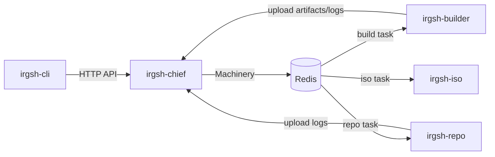
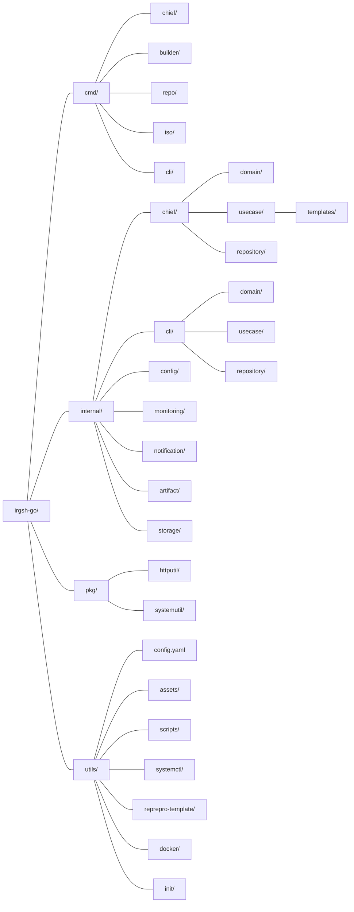

# CLAUDE.md - IRGSH-GO Project Guide

This document provides essential context for AI assistants working on the IRGSH-GO codebase.

## Project Overview

IRGSH-GO is a distributed Debian package building and repository management system written in Go. It automates the process of building, signing, and distributing Debian packages for the BlankOn Linux distribution.

## Architecture

The system follows a microservices architecture with Redis as the central message broker:



### Components

| Component | Port | Purpose |
|-----------|------|---------|
| **irgsh-chief** | 8080 | Central coordinator, API server, job scheduler |
| **irgsh-builder** | 8081 | Package build worker using pbuilder/Docker |
| **irgsh-repo** | 8082 | Repository manager using reprepro |
| **irgsh-iso** | 8083 | ISO image builder (minimal implementation) |
| **irgsh-cli** | N/A | Client tool for package maintainers |

## Directory Structure



| Path | Description |
|------|-------------|
| `cmd/chief/` | Central coordinator, API server, job scheduler (port 8080) |
| `cmd/builder/` | Package build worker using pbuilder/Docker (port 8081) |
| `cmd/repo/` | Repository manager using reprepro (port 8082) |
| `cmd/iso/` | ISO image builder (port 8083) |
| `cmd/cli/` | Client CLI tool for package maintainers |
| `internal/chief/domain/` | Chief domain types: `Submission`, `ISOSubmission`, `Maintainer`, `SubmitPayloadResponse`, `BuildStatusResponse`, status derivation, ID validation |
| `internal/chief/usecase/` | Chief business logic split into services (`ChiefUsecase`, `MaintainerService`, `StatusService`, `SubmissionService`, `UploadService`, `DashboardService`), port interfaces (`TaskQueue`, `GPGVerifier`, `FileStorage`, `JobStore`, `ISOJobStore`, `InstanceRegistry`), and embedded dashboard template |
| `internal/chief/repository/` | Chief repository adapters: `GPG` (signature verification), `Storage` (on-disk file management), `Machinery` (task queue) |
| `internal/cli/domain/` | CLI domain types: `Config`, `Submission`, `SubmitParams`, `ISOSubmission`, API response structs (`PackageStatus`, `ISOStatus`, `SubmitResponse`, etc.) |
| `internal/cli/usecase/` | CLI business logic (`CLIUsecase`): config, package submit/status/log, ISO submit/status/log, retry, update; port interfaces (`ConfigStore`, `PipelineStore`, `ChiefAPI`, `RepoSync`, `ShellRunner`, `DebianPackager`, `GPGSigner`, etc.) |
| `internal/cli/repository/` | CLI repository adapters: `HTTPChiefClient`, `ConfigStore`, `PipelineStore`, `RepoSync`, `ShellRunner`, `DebianPackager`, `GPGSigner`, `ReleaseFetcher`, `UpdateApplier`, `Prompter` |
| `internal/config/` | Configuration loading and validation from YAML |
| `internal/monitoring/` | Worker health tracking, heartbeats, job history, instance registry |
| `internal/notification/` | Webhook POST notifications on job completion |
| `internal/artifact/` | Artifact storage using repo/service/endpoint pattern |
| `internal/storage/` | SQLite database for persistent job and ISO job data |
| `pkg/httputil/` | JSON response helpers, `HTTPError`, `HTTPStatusError`, retry utilities |
| `pkg/systemutil/` | Shell command execution and log streaming |
| `utils/` | Config template, init scripts, systemd units, reprepro templates, Dockerfile |

## Build Commands

```bash
# Build all binaries
make build

# Build and run in development mode
make chief    # Runs with DEV=1
make builder
make repo

# Run tests with coverage
make test

# Build Debian package
make deb

# Initialize components
make builder-init
make repo-init
```

## Configuration

Configuration file: `/etc/irgsh/config.yaml` (or `./utils/config.yaml` for development)

Key sections:
- `redis`: Connection string for Redis broker
- `storage`: SQLite database path for persistent job data
- `monitoring`: Worker heartbeat and cleanup settings
- `notification`: Webhook URL for job notifications
- `chief/builder/repo/iso`: Component-specific settings

**Special: irgsh-repo requires explicit config path:**
```bash
irgsh-repo -c /path/to/config.yaml
```

## Key Patterns

### Task Queue (Machinery)
Jobs are distributed via Redis using the machinery library:
- Tasks: `build`, `repo`
- Queue: `irgsh`
- Workers register handlers and process jobs asynchronously

### Monitoring
- Workers send heartbeats every 30 seconds
- Instances marked offline after 90 seconds without heartbeat
- Job history retained for 7 days
- Redis keys: `irgsh:instances:*`, `irgsh:jobs:*`

### Notifications
When `notification.webhook_url` is configured, POST requests are sent on job completion:
```json
{"title": "IRGSH Build Job SUCCESS", "message": "Job ID: xxx\nStatus: SUCCESS\n..."}
```

### Pipeline Flow
1. CLI validates and submits package (GPG signed)
2. Chief queues build task to Redis
3. Builder downloads, builds with pbuilder, uploads artifacts
4. Chief queues repo task
5. Repo downloads artifacts, injects into reprepro repository

### Wire Format Coupling
The CLI and chief define parallel `Submission`/`ISOSubmission` structs with matching
`json:"..."` tags but no shared Go type. The CLI types are strict subsets of the chief
types (chief adds server-assigned `TaskUUID` and `Timestamp` fields). Response types
(`PackageStatus`, `SubmitResponse`, etc.) are also independently defined in each domain
package.

Builder and repo receive serialized submissions via the machinery task queue and unmarshal
into `map[string]interface{}`, accessing fields by string key with no compile-time safety.

Changes to the wire format must be coordinated manually across all four components:
- `internal/cli/domain/submission.go` (CLI sends)
- `internal/chief/domain/submission.go` (chief receives)
- `cmd/builder/builder.go` (builder consumes via map)
- `cmd/repo/repo.go` (repo consumes via map)

## Testing

```bash
# Run all tests
make test

# Generate coverage report
make coverage

# Test files are co-located with source throughout the codebase:
cmd/builder/builder_test.go          # integration (requires -tags integration)
cmd/builder/init_test.go             # integration (requires -tags integration)
cmd/repo/repo_test.go                # integration (requires -tags integration)
internal/artifact/repo/file_impl_test.go
internal/artifact/service/artifact_test.go
internal/cli/repository/config_store_test.go
internal/cli/repository/pipeline_store_test.go
internal/cli/usecase/config_test.go
internal/cli/usecase/iso_test.go
internal/cli/usecase/mocks_test.go
internal/cli/usecase/package_test.go
internal/cli/usecase/retry_test.go
internal/storage/iso_jobs_test.go
internal/storage/jobs_test.go
pkg/httputil/response_test.go
```

## Common Development Tasks

### Adding a New Config Field
1. Add struct field to appropriate config type in `internal/config/config.go`
2. Add to `IrgshConfig` struct if new section
3. Update `utils/config.yaml` with example
4. Access via `irgshConfig.Section.Field`

### Adding a New API Endpoint (Chief)
1. Add method to the appropriate service in `internal/chief/usecase/`
2. Add method to `ChiefService` interface in `cmd/chief/handler.go`
3. Add handler function in `cmd/chief/handler.go`
4. Register route in `serve()` function in `cmd/chief/main.go`
5. Use `httputil.ResponseJSON()` for responses

### Adding Worker Functionality
1. Implement function in component's main package (e.g., `cmd/builder/builder.go`)
2. Register with machinery if it's a distributed task
3. Add notification call for job completion if needed

## Dependencies

Key libraries:
- `github.com/RichardKnop/machinery/v1` - Distributed task queue
- `github.com/go-redis/redis/v8` - Redis client
- `github.com/urfave/cli` - CLI framework
- `github.com/ghodss/yaml` - YAML parsing
- `gopkg.in/go-playground/validator.v9` - Struct validation
- `gopkg.in/src-d/go-git.v4` - Git operations

## Version Management

- Version stored in `/VERSION` file
- Injected at build time via `LDFLAGS`
- Debian changelog in `/debian/changelog`
- Bump both files when releasing

## Important Notes

1. **DEV mode**: Set `DEV=1` to redirect workdirs from `/var/lib/` to `./tmp/`
2. **Config validation**: All required fields must be present or startup fails
3. **GPG keys**: Chief and Repo require GPG keys for signing
4. **Redis required**: All components depend on Redis being available
5. **irgsh-repo isolation**: Each instance needs its own config for multi-arch support
6. **SQLite storage**: Chief uses SQLite at `/var/lib/irgsh/chief/irgsh.db` (or `./tmp/irgsh/chief/irgsh.db` in DEV mode) for persistent job data
