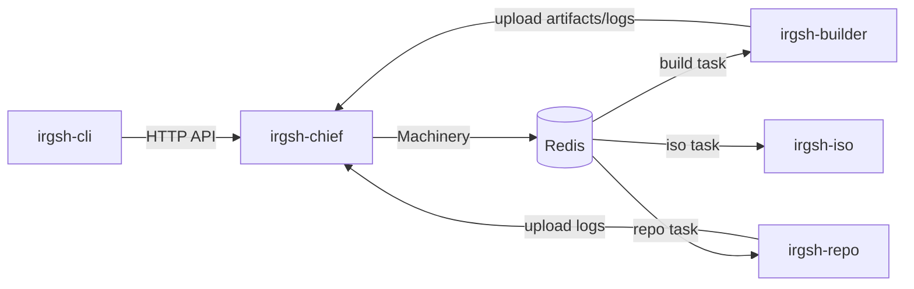
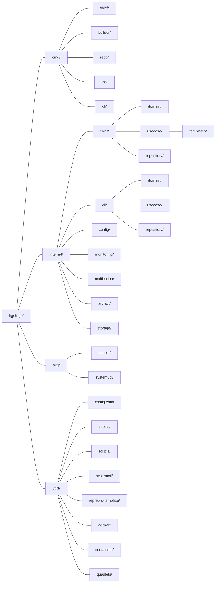

# CLAUDE.md - IRGSH-GO Project Guide

This document provides essential context for AI assistants working on the IRGSH-GO codebase.

## Project Overview

IRGSH-GO is a distributed Debian package building and repository management system written in Go. It automates the process of building, signing, and distributing Debian packages for the BlankOn Linux distribution.

## Architecture

The system follows a microservices architecture with Redis as the central message broker:


```mermaid
graph LR
    CLI[irgsh-cli] -->|HTTP API| Chief[irgsh-chief]
    Chief -->|Machinery| Redis[(Redis)]
    Redis -->|build task| Builder[irgsh-builder]
    Redis -->|repo task| Repo[irgsh-repo]
    Redis -->|iso task| ISO[irgsh-iso]
    Builder -->|upload artifacts/logs| Chief
    Repo -->|upload logs| Chief
```

### Components

| Component | Port | Purpose |
|-----------|------|---------|
| **irgsh-chief** | 8080 | Central coordinator, API server, job scheduler |
| **irgsh-builder** | 8081 | Package build worker using pbuilder/Docker |
| **irgsh-repo** | 8082 | Repository manager using reprepro |
| **irgsh-iso** | 8083 | ISO image builder (minimal implementation) |
| **irgsh-cli** | N/A | Client tool for package maintainers |

## Directory Structure


```mermaid
graph LR
    root["irgsh-go/"] --- cmd["cmd/"]
    root --- internal["internal/"]
    root --- pkg["pkg/"]
    root --- utils["utils/"]

    cmd --- cmd_chief["chief/"]
    cmd --- cmd_builder["builder/"]
    cmd --- cmd_repo["repo/"]
    cmd --- cmd_iso["iso/"]
    cmd --- cmd_cli["cli/"]

    internal --- chief["chief/"]
    internal --- cli["cli/"]
    internal --- config["config/"]
    internal --- monitoring["monitoring/"]
    internal --- notification["notification/"]
    internal --- artifact["artifact/"]
    internal --- storage["storage/"]

    chief --- chief_domain["domain/"]
    chief --- chief_usecase["usecase/"]
    chief --- chief_repo["repository/"]

    chief_usecase --- chief_templates["templates/"]

    cli --- cli_domain["domain/"]
    cli --- cli_usecase["usecase/"]
    cli --- cli_repo["repository/"]

    pkg --- httputil["httputil/"]
    pkg --- systemutil["systemutil/"]

    utils --- config_yaml["config.yaml"]
    utils --- assets["assets/"]
    utils --- scripts["scripts/"]
    utils --- systemctl["systemctl/"]
    utils --- reprepro["reprepro-template/"]
    utils --- docker["docker/"]
    utils --- containers["containers/"]
    utils --- quadlets["quadlets/"]
```

| Path | Description |
|------|-------------|
| `cmd/chief/` | Central coordinator, API server, job scheduler (port 8080) |
| `cmd/builder/` | Package build worker using pbuilder/Docker (port 8081) |
| `cmd/repo/` | Repository manager using reprepro (port 8082) |
| `cmd/iso/` | ISO image builder (port 8083) |
| `cmd/cli/` | Client CLI tool for package maintainers |
| `internal/chief/domain/` | Chief domain types: `Submission`, `ISOSubmission`, `Maintainer`, `SubmitPayloadResponse`, `BuildStatusResponse`, status derivation, ID validation |
| `internal/chief/usecase/` | Chief business logic split into services (`ChiefUsecase`, `MaintainerService`, `StatusService`, `SubmissionService`, `UploadService`, `DashboardService`), port interfaces (`TaskQueue`, `GPGVerifier`, `FileStorage`, `JobStore`, `ISOJobStore`, `InstanceRegistry`), and embedded dashboard template |
| `internal/chief/repository/` | Chief repository adapters: `GPG` (signature verification), `Storage` (on-disk file management), `Machinery` (task queue) |
| `internal/cli/domain/` | CLI domain types: `Config`, `Submission`, `SubmitParams`, `ISOSubmission`, API response structs (`PackageStatus`, `ISOStatus`, `SubmitResponse`, etc.) |
| `internal/cli/usecase/` | CLI business logic (`CLIUsecase`): config, package submit/status/log, ISO submit/status/log, retry, update; port interfaces (`ConfigStore`, `PipelineStore`, `ChiefAPI`, `RepoSync`, `ShellRunner`, `DebianPackager`, `GPGSigner`, etc.) |
| `internal/cli/repository/` | CLI repository adapters: `HTTPChiefClient`, `ConfigStore`, `PipelineStore`, `RepoSync`, `ShellRunner`, `DebianPackager`, `GPGSigner`, `ReleaseFetcher`, `UpdateApplier`, `Prompter` |
| `internal/config/` | Configuration loading and validation from YAML |
| `internal/monitoring/` | Worker health tracking, heartbeats, job history, instance registry |
| `internal/notification/` | Webhook POST notifications on job completion |
| `internal/artifact/` | Artifact storage using repo/service/endpoint pattern |
| `internal/storage/` | SQLite database for persistent job, ISO job and import job data |
| `internal/logstream/` | Live job log streaming from workers to chief over Redis |
| `pkg/httputil/` | JSON response helpers, `HTTPError`, `HTTPStatusError`, retry utilities |
| `pkg/systemutil/` | Shell command execution and log streaming |
| `utils/` | Config template, init scripts, systemd units, reprepro templates, Dockerfile, Containerfiles (`containers/`), Podman Quadlet units (`quadlets/`) |

## Build Commands

```bash
# Build all binaries
make build

# Build and run in development mode
make chief    # Runs with DEV=1
make builder
make repo

# Run tests with coverage
make test

# Build Debian package
make deb

# Initialize components
make builder-init
make repo-init
```

## Configuration

Configuration file: `/etc/irgsh/config.yaml` (or `./utils/config.yaml` for development)

Key sections:
- `redis`: Connection string for Redis broker (always required)
- `storage`: SQLite database path for persistent job data
- `monitoring`: Worker heartbeat and cleanup settings
- `notification`: Webhook URL for job notifications
- `chief/builder/repo/iso`: Component-specific settings

**Each binary only requires `redis:` plus its own section.** Config
validation is scoped per component (`config.LoadConfig(config.ComponentX)`),
so a config file passed to `irgsh-repo` needs `redis:` + `repo:` only - it
does not need `chief:`/`builder:` populated, and vice versa. This is what
lets chief, builder, repo and iso be deployed as independent processes,
possibly on different machines, without sharing one fully-populated file.

**Special: irgsh-repo requires explicit config path:**
```bash
irgsh-repo -c /path/to/config.yaml
```

## Key Patterns

### Multi-Distribution Support
Chief is distribution-agnostic: it holds no dist config of its own and just
routes tasks. Builder, repo, and iso each have a fixed distribution identity
(`dist_codename` in their own config section), and only ever handle tasks for
that one distribution. `irgsh-cli` picks the target with `--dist verbeek`
(package/ISO submit) or `--repo-dist verbeek` (import, since `import` already
uses `--dist` for the *source* suite being imported from).

### Task Queue (Machinery)
Jobs are distributed via Redis using the machinery library:
- Tasks: `build`, `repo`, `import`, `iso`
- Queue: `irgsh-<dist_codename>`, one per distribution - a builder/repo/iso
  instance's queue is derived from its own configured `dist_codename`
  (`config.DistQueue(dist)`), and chief sets `Signature.RoutingKey` to the
  submission's target dist when sending each task. Instances for the same
  dist share one queue, exactly like the single global `irgsh` queue this
  replaced - each still only registers and handles its own task name(s).
- Workers register handlers and process jobs asynchronously

### Monitoring
- Workers send heartbeats every 30 seconds
- Instances marked offline after 90 seconds without heartbeat
- Job history retained for 7 days
- Redis keys: `irgsh:instances:*`, `irgsh:jobs:*`

### Notifications
When `notification.webhook_url` is configured, POST requests are sent on job completion:
```json
{"title": "IRGSH Build Job SUCCESS", "message": "Job ID: xxx\nStatus: SUCCESS\n..."}
```

### Import Flow
`irgsh-cli import` submits a request to import already built packages from an
external Debian repository. The `import` task is handled by irgsh-repo:
1. CLI submits `--source`, `--dist` (source suite), `--repo-dist` (our
   distribution to inject into) and `--package-name` to chief
2. Chief queues an `import` task to the `--repo-dist` distribution's queue
3. Repo worker builds a throwaway apt root pointing at the source repository,
   resolves each binary package to its source package, then downloads the
   `.dsc` with its tarballs and every binary built from that source
4. Repo worker simulates installing the downloaded packages against our
   repository plus its configured upstream distribution (`apt-get --simulate`),
   and fails the job if they are not installable
5. Repo worker injects them with `reprepro includedsc` / `includedeb`,
   supplying `--section`/`--priority` from the source index because a `.dsc`
   usually carries neither

Unlike the packaging flow, reprepro runs without `--nothingiserror`, so a
version our repository already carries is skipped rather than failing the job.
Use `--force-version` to replace it.

The source repository is verified against every keyring installed on the repo
worker, collected from both `/etc/apt/trusted.gpg.d` and `/usr/share/keyrings`
(a derivative like BlankOn keeps its own key in the former and the Debian
archive keys in the latter). Use `--keyring <path>` for a repository whose key
is elsewhere, or `--insecure` to skip verification.

Importing from a newer suite than the repository is based on is how a package
that nobody can install gets in, so dependencies are checked twice:

- **In the CLI, before submitting.** The maintainer's machine already runs the
  distribution, so its own apt sources are the target. The source repository is
  added as an extra source, pinned (`Pin: release n=<dist>`, priority -1) so
  only the named packages may come from it and their dependencies must be
  satisfied by the distribution. `--skip-check` bypasses it; a machine without
  apt skips it with a note.
- **In the repo worker, before injecting.** The downloaded `.deb` files are
  resolved against the exported distribution in
  `<repo workdir>/<codename>/www`. The configured upstream is deliberately not
  added: the repository merges upstream into itself, so what users can install
  is what we have published, and adding the live upstream would satisfy
  dependencies from the very suite the packages come from.

`--dry-run` fetches and checks without injecting; `--ignore-dependencies`
imports anyway.

### Pipeline Flow
1. CLI validates and submits package (GPG signed) with `--dist <target>`
2. Chief queues build task to the target dist's queue (`irgsh-<dist>`)
3. Builder downloads, builds with pbuilder, uploads artifacts
4. Chief queues repo task on the same dist's queue
5. Repo downloads artifacts, injects into reprepro repository

### ISO Flow
`irgsh-cli build-iso --dist verbeek --branch without-praya` builds a live image.
The live-build git repository is **not** part of the submission: it is the ISO
worker's own config (`iso.repo_url`), the same way its distribution is. A client
only names the dist and the branch.

1. CLI submits `--dist` and `--branch` (plus optional `--no-cache`) to chief
2. Chief queues an `iso` task to that dist's queue
3. The ISO worker writes a `.env` into `iso.workdir` from its config
   (`BUILD_JAHITAN_PATH`, `BUILD_PUBLISH_URL`, `BUILD_LOCKFILE`,
   `TELEGRAM_BOT_KEY`) and runs the bundled
   `/usr/share/irgsh/iso-build.sh <repo_url> <branch>` there
4. The script clones the live-build repo at that branch, copies its `config/`
   into the workdir, runs `lb build`, and on success exports the image to
   `<iso.outputdir>/<YYYYMMDD>-<n>/` and republishes `current/`

`iso.workdir` is a **persistent live-build tree**, not a per-job directory:
`chroot/`, `cache/`, `auto/` and `local/` are reused between builds so a rebuild
does not start from scratch. `--no-cache` makes the worker clear those four
before invoking the script.

Success is not "an ISO exists in `current/`" — the script only advances
`current/` on success, so a previous build's output would make a failed job look
successful. The worker snapshots `current/current.txt` before the build and
requires it to have changed afterwards, on top of the script's exit code.

The finished image stays on the worker; nothing is uploaded to chief.

### Wire Format Coupling
The CLI and chief define parallel `Submission`/`ISOSubmission` structs with matching
`json:"..."` tags but no shared Go type. The CLI types are strict subsets of the chief
types (chief adds server-assigned `TaskUUID` and `Timestamp` fields). Both carry a
`dist` field naming the target distribution, used for queue routing. Response types
(`PackageStatus`, `SubmitResponse`, etc.) are also independently defined in each domain
package.

Builder and repo receive serialized submissions via the machinery task queue and unmarshal
into `map[string]interface{}`, accessing fields by string key with no compile-time safety.
Both also defensively check `raw["dist"]` against their own configured `dist_codename` and
reject a misrouted task, on top of the queue-name routing.

Changes to the wire format must be coordinated manually across all four components:
- `internal/cli/domain/submission.go` (CLI sends)
- `internal/chief/domain/submission.go` (chief receives)
- `cmd/builder/builder.go` (builder consumes via map)
- `cmd/repo/repo.go` (repo consumes via map)

The import job has its own wire format, unmarshalled into a struct rather than
a map:
- `internal/cli/domain/import.go` (CLI sends)
- `internal/chief/domain/submission.go` (`ImportSubmission`, chief receives)
- `cmd/repo/import.go` (`importSubmission`, repo consumes)

Its `dist` field means the *source* suite being imported from, so it carries
a separate `targetDist` field (CLI flag `--repo-dist`) naming which of our
distributions - and therefore which repo instance's queue - to route to.

The ISO job likewise unmarshals into a struct rather than a map:
- `internal/cli/domain/iso.go` (CLI sends)
- `internal/chief/domain/submission.go` (`ISOSubmission`, chief receives)
- `cmd/iso/iso.go` (`ISOSubmission`, the worker consumes)

It carries only `dist`, `branch` and `noCache` - the repository URL comes from
the worker's `iso.repo_url`, so chief never sees it (the `iso_jobs.repo_url`
column is retained but written empty).

## Testing

```bash
# Run all tests
make test

# Generate coverage report
make coverage

# Test files are co-located with source throughout the codebase:
cmd/builder/builder_test.go          # integration (requires -tags integration)
cmd/builder/init_test.go             # integration (requires -tags integration)
cmd/repo/repo_test.go                # integration (requires -tags integration)
internal/artifact/repo/file_impl_test.go
internal/artifact/service/artifact_test.go
internal/cli/repository/config_store_test.go
internal/cli/repository/pipeline_store_test.go
internal/cli/usecase/config_test.go
internal/cli/usecase/iso_test.go
internal/cli/usecase/mocks_test.go
internal/cli/usecase/package_test.go
internal/cli/usecase/retry_test.go
internal/storage/iso_jobs_test.go
internal/storage/jobs_test.go
pkg/httputil/response_test.go
```

## Common Development Tasks

### Adding a New Config Field
1. Add struct field to appropriate config type in `internal/config/config.go`
2. Add to `IrgshConfig` struct if new section
3. Update `utils/config.yaml` with example
4. Access via `irgshConfig.Section.Field`

### Adding a New API Endpoint (Chief)
1. Add method to the appropriate service in `internal/chief/usecase/`
2. Add method to `ChiefService` interface in `cmd/chief/handler.go`
3. Add handler function in `cmd/chief/handler.go`
4. Register route in `serve()` function in `cmd/chief/main.go`
5. Use `httputil.ResponseJSON()` for responses

### Adding Worker Functionality
1. Implement function in component's main package (e.g., `cmd/builder/builder.go`)
2. Register with machinery if it's a distributed task
3. Add notification call for job completion if needed

## Dependencies

Key libraries:
- `github.com/RichardKnop/machinery/v1` - Distributed task queue
- `github.com/go-redis/redis/v8` - Redis client
- `github.com/urfave/cli` - CLI framework
- `github.com/ghodss/yaml` - YAML parsing
- `gopkg.in/go-playground/validator.v9` - Struct validation
- `gopkg.in/src-d/go-git.v4` - Git operations

## Version Management

- Version stored in `/VERSION` file
- Injected at build time via `LDFLAGS`
- Debian changelog in `/debian/changelog`
- Bump both files when releasing

## Important Notes

1. **DEV mode**: Set `DEV=1` to redirect workdirs from `/var/lib/` to `./tmp/`
2. **Config validation**: Required fields are scoped per component (its own section + `redis:`) - see Configuration above. `chief.address` is the exception: workers need it to reach chief but it lives outside their own section, so builder/repo/iso check it explicitly at startup instead
3. **GPG keys**: Chief and Repo require GPG keys for signing
4. **Redis required**: All components depend on Redis being available
5. **irgsh-repo isolation**: Each instance needs its own config for multi-arch/multi-dist support
6. **Multi-distribution**: Builder/repo/iso each serve exactly one `dist_codename`; running more than one distribution means running more than one instance of each, each with its own config and queue (`irgsh-<dist_codename>`)
7. **SQLite storage**: Chief uses SQLite at `/var/lib/irgsh/chief/irgsh.db` (or `./tmp/irgsh/chief/irgsh.db` in DEV mode) for persistent job data
8. **ISO worker prerequisites**: passwordless `sudo`, plus `git`, `live-build` and `zsyncmake`. The build script holds a lockfile and refuses concurrent runs, matching `server.NewWorker("iso", 1)`
