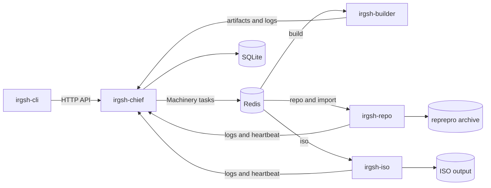

# IRGSH Architecture

Length convention: two to four pages means approximately 1,000–2,000 words when
rendered on A4 paper at 11 pt with normal margins, excluding diagrams and the
source index. This document describes implemented behavior at the current
revision. Proposed changes are isolated in the final section.

## System context

IRGSH builds Debian packages, imports existing Debian packages, maintains a
published repository, and builds live ISO images. It is a distributed system:
the CLI submits work to chief, chief persists and schedules it through Redis,
and distribution-specific workers execute it.

Chief is distribution-agnostic. Each builder, repo, and ISO worker has one fixed
`dist_codename`. Machinery routing uses `irgsh-<dist_codename>` queues, so several
instances may serve one distribution while an instance never serves a different
distribution. Workers also validate the distribution carried by a task instead
of trusting routing alone.

## Components

`irgsh-cli` runs on a maintainer's machine. It manages local configuration,
prepares and signs package submissions, asks chief for job state and logs,
resolves import dependencies, and submits package, import, cancellation, retry,
and ISO requests. CLI domain types intentionally mirror, but do not share, the
chief wire types.

`irgsh-chief` exposes the HTTP API and dashboard. Its use cases authenticate
signed package submissions, persist jobs, select a distribution queue, dispatch
Machinery tasks, receive artifacts and logs, derive pipeline status, and signal
cancellation. SQLite is the authoritative durable job store; Redis is
coordination state, not a replacement for job persistence.

`irgsh-builder` consumes `build` tasks. It downloads a signed submission,
prepares a job workspace, builds the source with pbuilder inside the `pbocker`
container, verifies expected package output, and uploads artifacts and logs to
chief. Initialization creates the pbuilder base and container image separately
from normal job handling.

`irgsh-repo` consumes `repo` and `import` tasks. A repo task downloads builder
artifacts and injects them into the normal or experimental reprepro suite. An
import task resolves and downloads packages from an external Debian repository,
checks their installability, and injects the requested versions. Reprepro state
and its exported `www` tree are durable state owned by the repo worker.

`irgsh-iso` consumes `iso` tasks. It runs the bundled live-build script against
the worker-configured repository and the client-selected branch. Its workdir is
a persistent live-build tree whose cache, chroot, auto, and local directories are
reused unless the submission requests `noCache`. Finished images stay on the ISO
worker under its output directory.

Redis carries Machinery tasks, worker heartbeats, job-history observations, live
log messages, and cancellation signals. It is therefore both a scheduling and
availability dependency. Loss of Redis prevents new distributed work and live
cancellation even though chief's stored job rows remain in SQLite.

## End-to-end flows

### Package pipeline

The maintainer selects a target distribution and submits signed source and
packaging data. Chief verifies the submission, stores its metadata, and sends a
`build` task to the target distribution queue. A builder for that distribution
builds in an owned workspace and uploads the artifact bundle to chief. Only a
successful, complete build advances the pipeline. Chief then sends a `repo` task
to the same distribution queue. Repo downloads the bundle, injects it with
reprepro, exports the archive, and uploads its log.

Experimental packages use `<dist>-experimental` as a separate suite. The package
component remains the submission's component; experimental is never represented
as a component.

### Import pipeline

The CLI receives a source repository, source suite, target distribution,
components, and package names. Before submission it can query chief for the
target repository URL and resolve whether the requested source packages need
additional source packages. A dependency absent from the target may be proposed
as an additional import. A dependency already present at an incompatible version
is a blocker rather than permission to replace a distribution foundation such as
`libc6`. Added sources require confirmation unless `--yes` is used.

Chief routes the import to the target distribution's repo queue. The worker
creates a throwaway apt root, verifies the external repository unless the caller
explicitly selected the insecure mode, resolves every requested binary to its
source, and downloads the source plus all binaries built by that source.

The worker indexes the downloads as a temporary repository and checks every
binary separately against two inputs: the downloaded sibling packages and the
already exported target archive. It deliberately does not add the configured
live upstream. Reprepro has already merged upstream content into the published
archive; consulting upstream again could make an import appear installable by
using packages that users cannot obtain from the target archive.

An import represents an exact maintainer choice. Before injection, the worker
removes existing source and binary versions that differ, whether older or newer,
then injects the downloaded version. An identical version is normally left in
place unless `--force-version` requests reinjection.

### ISO pipeline

The client submits a target distribution, live-build branch, and optional
`noCache`. The live-build repository URL belongs to worker configuration and is
not accepted from the client. Chief routes the task to the target distribution's
ISO queue. The worker writes its build environment, optionally clears the four
reused directories, and invokes the installed build script.

Success requires both a zero script exit and a changed `current/current.txt`.
This prevents an old image in `current/` from making a failed build look
successful. The image is published only on the worker; chief stores status and
logs, not the ISO artifact.

## Trust and privilege boundaries

The maintainer-to-chief HTTP boundary accepts files, identifiers, URLs, and signed
metadata. Authentication does not make those values safe for paths, process
arguments, archive extraction, or queue payloads. Chief validates API input;
workers validate again before filesystem or process operations because Redis
payloads have no compile-time wire guarantee.

The external-repository boundary includes repository metadata, package indices,
source archives, binary packages, and signing keys. Import normally verifies the
source using installed or explicitly selected keyrings. `--insecure` is an
explicit trust reduction, not a successful verification.

The process boundary includes Bash-based helpers and standard tools such as apt,
pbuilder, Docker, reprepro, GPG, tar, and live-build. Dynamic values must be
validated and passed as process arguments where possible. Shell pipelines that
remain must quote every dynamic value and must not expose credentials in the
logged command.

Builder base initialization and ISO builds cross a root boundary. Builder
initialization installs host packages and changes root-owned pbuilder state. ISO
builds require passwordless sudo and can create root-owned process trees. Repo
initialization destroys and recreates configured suites. These operations belong
on explicitly authorized, isolated hosts; normal development and tests must not
silently invoke them.

## Persistent state and invariants

Chief stores package, ISO, and import jobs in SQLite. Terminal states must not be
overwritten by a later Machinery result. Uploaded submissions, artifacts, and
logs live on chief's filesystem and must stay confined to their assigned paths.

Redis holds instance records, task delivery, live logs, and cancellation marks.
Worker identity combines hostname, component type, and distribution so multiple
distribution workers on one host remain distinct. Heartbeat expiry affects
availability reporting, not durable job ownership.

Repo owns reprepro databases and exported archives. A running reprepro mutation
is an integrity boundary: interruption during injection or export can corrupt the
archive. ISO owns a persistent build tree and versioned output directories.
Builder owns per-job workspaces and container IDs needed to clean up a canceled
container build.

Wire formats are coupled across independently declared types. Package and ISO
submission fields must stay aligned between CLI and chief, while builder and repo
currently decode package submissions from string-keyed maps. Import has parallel
CLI, chief, and repo structs plus a compatibility normalization for payloads from
releases before 2.2.0. Any wire change must update every producer, consumer, and
regression test together.

## Failure and cancellation

Workers write command output to job logs and upload the logs even on failure when
transport remains available. Errors retain the failed operation and exit status.
Builder retries only recognized transient network failures and must never hand a
partial or stale artifact to repo.

Cancellation is a Redis mark plus a live publication. A worker checks the mark
before starting; a running interruptible job receives context cancellation. The
command helper places the process in its own group, sends SIGTERM, and escalates
to SIGKILL after the grace period. Builder also removes the container recorded in
its cidfile.

A repo task becomes uninterruptible before it touches reprepro. Chief rejects
cancellation after a repo task starts. Import remains interruptible during
download and dependency checking, then becomes uninterruptible immediately
before injection. A late cancellation is recorded and logged but cannot abort
the archive transaction. Chief records an accepted cancellation as terminal so a
later worker failure cannot replace it.

## Testing and delivery status

Unit and component tests live beside the Go packages. The routine gate is
`go vet ./...`, `go test -race ./...`, followed by a build. Pull request CI runs
those vet and race checks and builds a development release. The E2E workflow is
manual or nightly and currently uses privileged container assumptions, so it is
not evidence of rootless deployment.

Legacy builder and repo integration files are build-tagged and contain skipped
or host-sensitive initialization tests. They are cleanup candidates, not passing
coverage and not permission to run initialization on a developer or production
host.

The following work is proposed, not implemented by this document:

- [BlankOn/irgsh-go#29](https://github.com/BlankOn/irgsh-go/issues/29) owns
  broader test and rootless regression coverage.
- [BlankOn/irgsh-go#165](https://github.com/BlankOn/irgsh-go/issues/165) owns
  worker input, command, workspace, and failure hardening.
- [BlankOn/irgsh-go#229](https://github.com/BlankOn/irgsh-go/issues/229) owns
  CI/CD modernization and constrained deployment.

## Source index

- Component entry points: [`cmd/`](cmd/)
- Chief domain and use cases: [`internal/chief/`](internal/chief/)
- CLI domain and use cases: [`internal/cli/`](internal/cli/)
- Durable job storage: [`internal/storage/`](internal/storage/)
- Cancellation and live logs: [`internal/cancel/`](internal/cancel/),
  [`internal/logstream/`](internal/logstream/)
- Command execution: [`pkg/systemutil/`](pkg/systemutil/)
- Configuration and distribution queues: [`internal/config/`](internal/config/)
- Pull request checks: [`.github/workflows/pull-request.yaml`](.github/workflows/pull-request.yaml)
