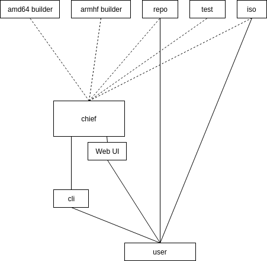

# irgsh-go

[](https://travis-ci.org/BlankOn/irgsh-go) [](https://goreportcard.com/report/github.com/BlankOn/irgsh-go) [](https://codecov.io/gh/BlankOn/irgsh-go)

IRGSH (https://groups.google.com/d/msg/blankon-dev/yvceclWjSw8/HZUL_m6-BS4J, pronunciation: *irgis*) is an all-in-one tool to create and maintain Debian-derived GNU/Linux distribution: from packaging to repository, from ISO build to release management. This codebase is a complete rewrite of the old IRGSH components (https://github.com/BlankOn?q=irgsh).

This is still under heavy development, therefore you should not rely on this for production since it still subject to breaking API changes.

Patches, suggestions and comments are welcome!

## Install


You need Docker, Redis and these packages,

```
gpg pbuilder debootstrap devscripts python-apt reprepro
```

Then install IRGSH with this command bellow,

```
curl -L -o- https://raw.githubusercontent.com/BlankOn/irgsh-go/master/install.sh | bash
```

The command will install the irgsh binaries, default configuration and daemons. A spesial user named `irgsh` will also be added to your system.

## Components

A minimal IRGSH ecosystem contains three services and a CLI tool.

- `irgsh-chief` acts as the master. The others (also applied to`irgsh-cli`) will talk to the chief. The chief also provides a web user interface for workers and pipelines monitoring.
- `irgsh-builder` is the builder worker of IRGSH.
- `irgsh-repo` will serves as repository so it may need huge volume of storage.
- `irgsh-cli` is a client-side tool to maintain packages.

### Architecture




GPG signature is used as authentication bearer on any submission attempt. Hence, you will need to register maintainer's public key to `irgsh`'s GPG keystore (read Initial setup).

## Initial setup

#### IRGSH

Please refer to `/etc/irgsh/config.yml` for available preferences. Change it as you need.

```
irgsh-init
```

#### CLI tool

This CLI tool intended to be used on maintainer's local system. It need to be configured first to define the `irgsh-chief` instance address and your GPG key as package mantainer,

```
irgsh-cli config --chief http://irgsh.blankonlinux.or.id:8080 --key B113D905C417D9C31DAD9F0E509A356412B6E77F
```

#### Registering a maintainer

A maintaner should have a GPG keypair on his machine. His/her public key need to be registered to `irgsh`'s GPG key store.

Export maintainer's GPG public key

```
gpg --armor --export 0D7D9A42E03ACFA2933227F7A13769F4DB99B6CD > /path/to/maintainer-public.key
```

The `public.key` file need to be transfered into where `irgsh-chief` live. Then import the maintainer's public key (on behalf of `irgsh`),

```
gpg --import < /path/to/maintainer-public.key
```

You can check the list of registered maintainer (on behalf of `irgsh`),

```
gpg -k
```

## Run

#### The Services

You can start them with,

```
sudo systemctl start irgsh-chief
sudo systemctl start irgsh-builder
sudo systemctl start irgsh-repo
```
Their logs are available at `/var/log/irgsh/`. After these three services are up and running, you may continue to work with `irgsh-cli`

#### CLI

Submit a package,

```
irgsh-cli submit --source https://github.com/BlankOn/bromo-theme.git --package https://github.com/BlankOn-packages/bromo-theme.git
```

Check the status of a pipeline,

```
irgsh-cli status 2019-04-01-174135_1ddbb9fe-0517-4cb0-9096-640f17532cf9
```

Inspect the log of a pipeline,

```
irgsh-cli log  2019-04-01-174135_1ddbb9fe-0517-4cb0-9096-640f17532cf9
```

Running `irgsh-cli status` and `irgsh-cli log` without argument will referenced to the latest submitted pipeline ID.

## FAQ

### Why rewrite it?

IRGSH was written in Python 2.6.x and it depends on some old and deprecated libraries. Even one of them (in a specific version, respectively) is no longer exists on the internet. A real dependency hell. It’s hard to deploy IRGSH in a modern operating system and it keeps alynne.blankonlinux.or.id from an important system upgrade. The IRGSH was also very modular but combining them into a working distributed cluster takes time and quite steep learning curve. We still need to prepare a lot of things manually before doing that. Pbuilder needs to be configured and setup. Which also true for the reprepro repository. No easy way.

Although, there is no doubt that the old IRGSH does its work well.

### Why Go?

For its portable compiled binary.

### Can I run the workers on different machines?

You can. Just make sure these workers pointed out to the same Redis server (see `/etc/irgsh/config.yml`). Also please consider this, https://redis.io/topics/security.

### Why is Docker required?

To build a package using `pbuilder`, `sudo` or root privilege is required but it's not okay to rely on root privilege for repetitive tasks. To get rid of this, we containerized the build process.

## Todos

### CLI

- Submit :heavy_check_mark:
- GPG signing :heavy_check_mark:
- Logging :heavy_check_mark:

### Chief

- Auth (GPG or mutual auth)
- WebSocket
- Builder registration
- Repo registration

### Builder

- Init:
  - base.tgz :heavy_check_mark:
- Clone :heavy_check_mark:
- Signing :heavy_check_mark:
- Build :heavy_check_mark:
- Upload :heavy_check_mark:
- Dockerized pbuilder :heavy_check_mark:
- Multiarch support
- RPM support

### Repo

- Init :heavy_check_mark:
- Sync :heavy_check_mark:
- Download :heavy_check_mark:
- Inject :heavy_check_mark:
- Rebuild repo :heavy_check_mark:
- Multiarch support
- RPM support

### PabrikCD

- Build
- Upload

### Release management

- Release cycle (RC, alpha, beta, final)
- Patches/Updates after release

### Others

- No sudo needed :heavy_check_mark:
- Daemonized instances :heavy_check_mark:
- Dockerized instances (docker-compose)
